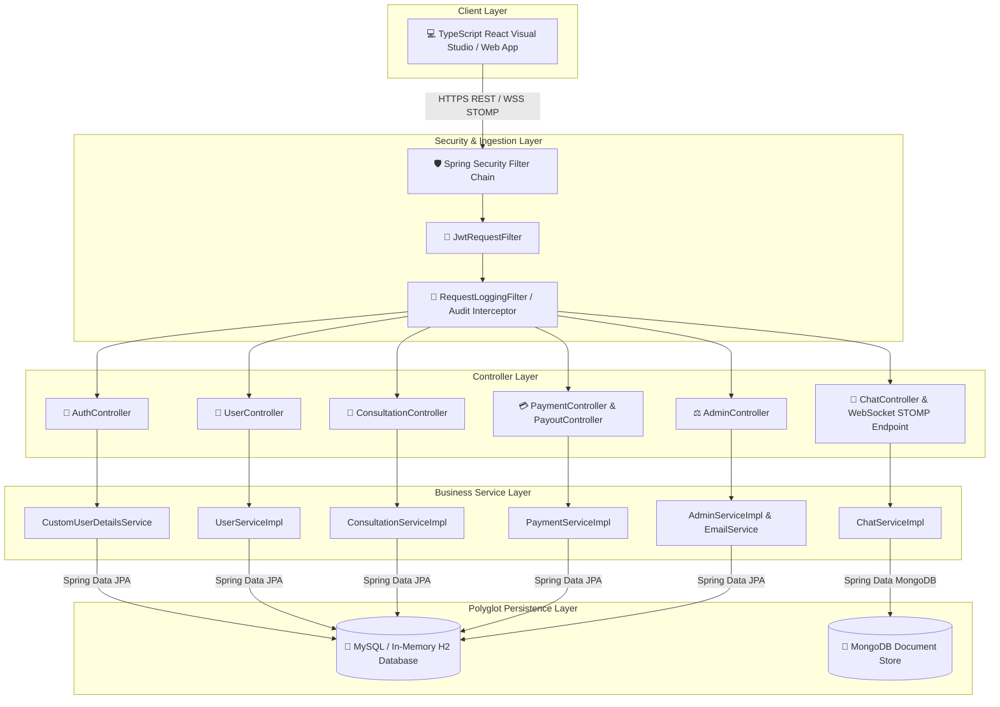

# 🏛️ Lawino Meet - System Architecture Document

Welcome to the architectural specification for **Lawino Meet**, a high-performance Legal & Financial Consultation Marketplace built using **Spring Boot 3**, **Java 17**, **Spring Security (JWT)**, **STOMP WebSockets**, **MySQL**, **MongoDB**, and **TypeScript React**.

---

## 📐 1. System Topology & High-Level Architecture

Lawino Meet uses a decoupled multi-layered architecture separating stateless REST/WebSocket controllers, business logic services, and polyglot persistence stores (Relational MySQL + Document MongoDB).

---

## 🔒 2. Security & Authentication Architecture

### 🛡️ Stateless JWT Security Chain
1. **Request Interception**: Incoming requests to `/api/**` pass through `SecurityConfig` and `JwtRequestFilter`.
2. **Token Extraction**: Reads `Authorization: Bearer <JWT_TOKEN>` header.
3. **Validation**: Decodes claims using HS256 key (`JwtUtil`) and validates token expiration.
4. **Context Injection**: populates `SecurityContextHolder` with `UsernamePasswordAuthenticationToken` containing authorities (`ROLE_CLIENT`, `ROLE_LAWYER`, `ROLE_ADMIN`).
5. **Public Endpoints**: `/api/auth/**`, `/ws/**`, `/swagger-ui/**` are explicitly permitted without auth.

---

## 💾 3. Polyglot Persistence Architecture

Lawino Meet leverages **Polyglot Persistence** to maximize write throughput and relational integrity:

| Data Domain | Database | Rationale / Benefits |
|---|---|---|
| **Users, Profiles, Consultations, Payments, Disputes, Audit Logs** | **MySQL / H2** | Strict ACID compliance, relational integrity (`User` ↔ `ProfessionalProfile`), foreign key constraints, financial ledger safety. |
| **Real-time Chat Messages & Chat Sessions** | **MongoDB** | High-concurrency schema-less document writes, fast indexing by `chatSessionId` and `timestamp`, low latency chat querying. |

---

## 💳 4. Escrow Accounting & Financial Ledger Model

To ensure **100% atomic transaction consistency**, Lawino Meet implements a **Fail-Closed Escrow Accounting System**:

1. **Client Checkout**: Client pays fee when booking a consultation or unlocking chat.
2. **Escrow Hold**: Funds are held in platform escrow until consultation completion or appointment fulfillment.
3. **Revenue Split Engine**:
   - **Online Consultations / Video / Chat**: 80% credited to Lawyer Digital Wallet, 20% retained as Platform Service Fee.
   - **Offline Office Appointments**: 90% credited to Lawyer Digital Wallet, 10% retained as Platform Service Fee.
4. **Payout Engine**: Lawyers request payout withdrawals (`PayoutRequest`) when wallet balance exceeds threshold, reviewed and processed by Admins.

---

## ⚡ 5. Real-Time Communication Architecture

- **Protocol**: WebSockets over STOMP (`/ws`).
- **Channel Security**: `ChatChannelInterceptor` inspects STOMP `CONNECT` frames to enforce JWT authentication.
- **Privacy Contact Masking**: Client phone numbers and email addresses are masked (`XXXXX-XXXXX`) until appointment payment is confirmed.
