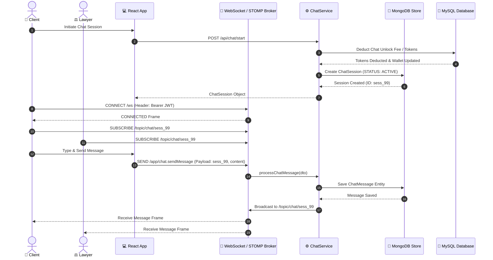
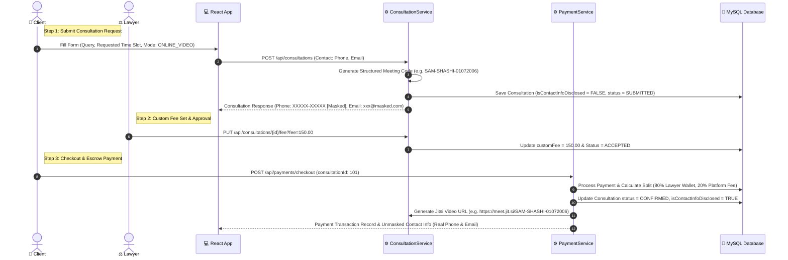
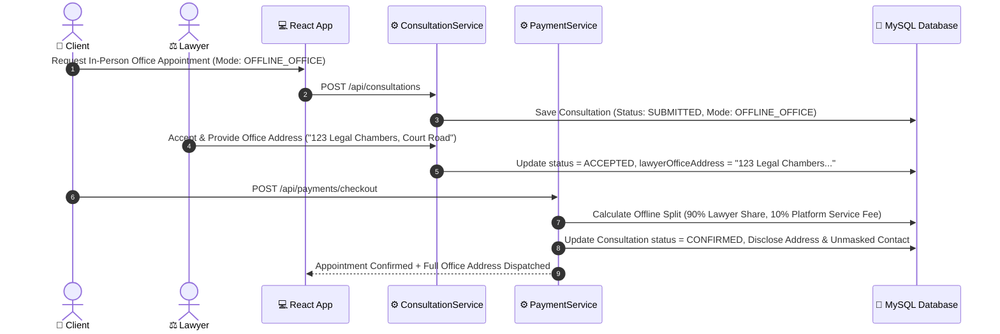
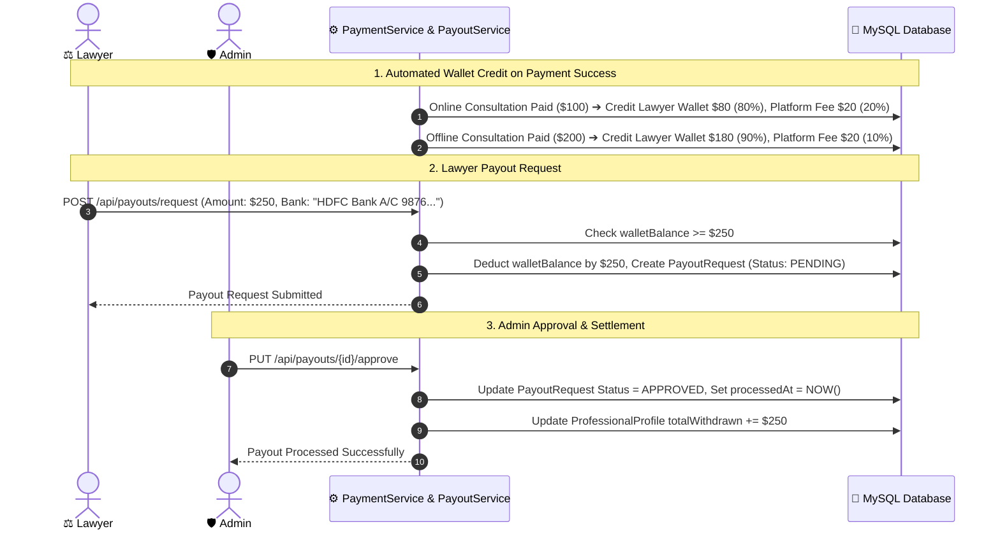
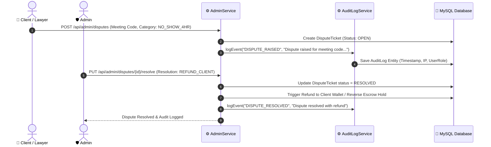

# 🔄 Lawino Meet - Core Workflows & Sequence Diagrams

This document contains end-to-end Mermaid sequence diagrams for all major business service workflows in the **Lawino Meet** platform.

---

## 1. 🔐 User Registration & Stateless JWT Authentication Workflow

```mermaid
sequenceDiagram
    autonumber
    actor User as 👤 Client / Lawyer
    participant ClientApp as 💻 React Frontend
    participant AuthCtrl as ⚙️ AuthController
    participant UserSvc as ⚙️ CustomUserDetailsService
    participant JwtUtil as 🔑 JwtUtil
    participant DB as 💾 MySQL Database

    rect rgb(20, 30, 50)
    note right of User: 1. Registration Flow
    User->>ClientApp: Fill Registration Form (Name, Email, Password, Role)
    ClientApp->>AuthCtrl: POST /api/auth/register
    AuthCtrl->>DB: Check if Email Exists
    DB-->>AuthCtrl: Email Available
    AuthCtrl->>DB: Save User & Encrypt Password (BCrypt)
    DB-->>AuthCtrl: User Saved (Role: CLIENT / LAWYER)
    AuthCtrl-->>ClientApp: 201 Created ("User Registered Successfully")
    end

    rect rgb(30, 45, 70)
    note right of User: 2. Login & JWT Generation Flow
    User->>ClientApp: Submit Login Credentials
    ClientApp->>AuthCtrl: POST /api/auth/login
    AuthCtrl->>UserSvc: loadUserByUsername(email)
    UserSvc->>DB: Query User Record
    DB-->>UserSvc: Return User Entity
    AuthCtrl->>AuthCtrl: Verify Password Match
    AuthCtrl->>JwtUtil: generateToken(UserDetails)
    JwtUtil-->>AuthCtrl: Return Signed HS256 JWT Token
    AuthCtrl-->>ClientApp: 200 OK { jwt: "eyJhbG...", message: "Auth Success" }
    ClientApp->>ClientApp: Store Token in localStorage ("lawinomeet_jwt_token")
    end
```

---

## 2. 💬 Real-Time WebSocket Chat & Token Accounting Workflow

---

## 3. 📹 Online Video Consultation & Privacy Contact Masking Workflow

---

## 4. 🏢 Offline Office Appointment & Address Dispatch Workflow

---

## 5. 💰 Dual-Wallet Escrow Accounting & Lawyer Payout Engine Workflow

---

## 6. ⚖️ Admin Governance, 4-Hour Dispute Resolution & Audit Ledger

